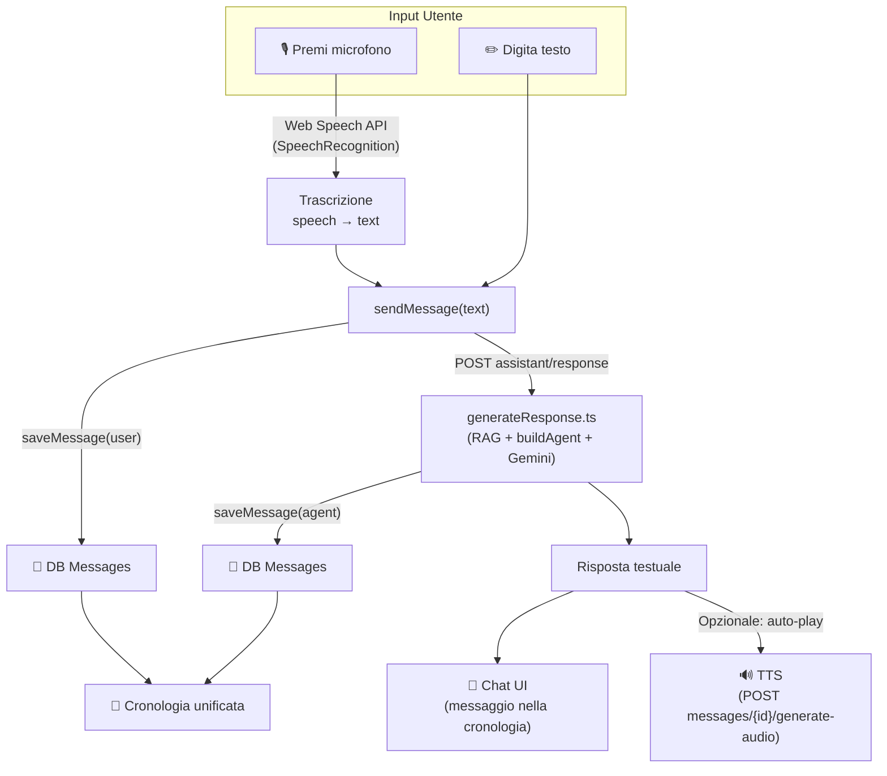

# 🔬 Refactoring Agent Chat — Un'unica Chat Multimodale

## La Visione: Un Solo Agent, Un Solo Flusso

Un'interfaccia chat unica dove l'utente **scrive o parla** — tutto finisce nella stessa cronologia, con la stessa memoria, e l'agente risponde in modo coerente. Esattamente come ChatGPT, Gemini, o qualsiasi agent AI moderno.

```
┌─────────────────────────────────────────────┐
│  Agente AI — Informatica                    │
├─────────────────────────────────────────────┤
│                                             │
│  🤖  Ciao! Sono il tuo assistente di...     │
│                                     10:30   │
│                                             │
│         Spiegami il pattern MVC  👤         │
│         10:31                               │
│                                             │
│  🤖  Il pattern MVC divide l'app in...      │
│  ▶ 🔊                              10:31   │
│                                             │
│         🎙️ "Fammi un esempio pratico"  👤   │
│         10:32                               │
│                                             │
│  🤖  Ecco un esempio con Express.js...      │
│  ▶ 🔊                              10:32   │
│                                             │
├─────────────────────────────────────────────┤
│  [  Scrivi un messaggio...      🎙️  ➤ ]    │
└─────────────────────────────────────────────┘
```

> I messaggi vocali dell'utente appaiono come testo trascritto con un badge 🎙️.
> Le risposte dell'agent hanno sempre il bottone ▶ 🔊 per ascoltarle.
> **Tutto salvato nella stessa cronologia.**

---

## Architettura Proposta



### Il concetto chiave

**La voce è solo una modalità di input/output, non un sistema separato.**

| | Prima (2 sistemi) | Dopo (1 sistema) |
|---|---|---|
| **Input testo** | `AgentChat` → `generateResponse` | Chat unica → `generateResponse` |
| **Input voce** | `VoiceAgent` → WebSocket Gemini Live | Chat unica → **STT browser** → `generateResponse` |
| **Output testo** | Mostrato in chat | Mostrato in chat |
| **Output audio** | Gemini Live audio stream | **TTS** dal testo (già esiste: `listenToMessage`) |
| **Cronologia** | Solo testo, voice non salvata | **Tutto salvato** nella stessa collection |
| **Memoria** | Separata | **Unica** — `buildConversationHistory` |

---

## Cosa Succede al Gemini Live (WebSocket)?

**Va rimosso/accantonato** per questa feature. Ecco perché:

Il Gemini Live API è un sistema di **conversazione audio real-time bidirezionale** — l'utente parla, l'AI risponde in audio streaming. È un paradigma completamente diverso:
- Non produce testo → impossibile salvare nella cronologia
- Non usa la stessa pipeline RAG → cerca su tutti i documenti senza filtri
- Non rispetta le impostazioni dell'assistant (tono, voce, nome)
- Non ha persistenza dei messaggi

Per un agent unificato con cronologia, il flusso giusto è:
1. **STT** (Speech-to-Text) per trascrivere l'input vocale → `SpeechRecognition` API del browser (gratis, zero backend)
2. **Stesso backend** testuale per generare la risposta
3. **TTS** (Text-to-Speech) per riprodurre la risposta → endpoint `generate-audio` che già esiste

> [!TIP]
> Il `GeminiLiveService` potrebbe essere riutilizzato in futuro per una modalità "conversazione live" separata (tipo telefonata con l'AI), ma per la chat standard con cronologia il flusso STT → Text API → TTS è molto più pulito e coerente.

---

## Componenti da Creare/Modificare

### Frontend

```
components/
├── agent-chat/                    ← REFACTORED (diventa il componente unico)
│   ├── agent-chat.ts              
│   ├── agent-chat.html            
│   └── agent-chat.scss            
│
├── agent-settings-form/           ← INVARIATO (solo teacher, step separato)
│   └── ...
│
├── voice-agent/                   ← DA RIMUOVERE (sostituito dall'input vocale nella chat)
│   └── ...  ❌
```

### Il nuovo `AgentChat` — Cosa cambia

#### Input area (il cuore della modifica)

```html
<!-- NUOVO: Input multimodale -->
<div class="chat-input-area">
  <div class="input-group">
    <!-- Textarea adattivo -->
    <textarea
      class="form-control"
      [(ngModel)]="inputMessage"
      (keydown)="onKeydown($event)"
      placeholder="Scrivi o parla..."
      rows="1"
    ></textarea>
    
    <!-- Bottone microfono (attiva/disattiva registrazione) -->
    <button 
      class="btn btn-mic"
      [class.recording]="isRecording()"
      (click)="toggleVoiceInput()"
      [disabled]="isLoading()"
    >
      <fa-icon [icon]="isRecording() ? faStop : faMicrophone"></fa-icon>
    </button>
    
    <!-- Bottone invio (appare solo se c'è testo) -->
    <button
      class="btn btn-primary btn-send"
      (click)="sendMessage()"
      [disabled]="!inputMessage.trim() || isLoading()"
      *ngIf="inputMessage.trim()"
    >
      <fa-icon [icon]="faPaperPlane"></fa-icon>
    </button>
  </div>
  
  <!-- Feedback visivo durante registrazione -->
  @if (isRecording()) {
    <div class="recording-indicator">
      <span class="pulse-dot"></span>
      <span class="recording-text">In ascolto...</span>
      <span class="transcript-preview">{{ liveTranscript() }}</span>
    </div>
  }
</div>
```

#### Messaggi — Aggiunta del badge "voce"

```html
<!-- Nel messaggio utente, mostra se era vocale -->
<div class="message-bubble user-message">
  @if (msg.inputType === 'voice') {
    <fa-icon [icon]="faMicrophone" class="voice-badge"></fa-icon>
  }
  <span>{{ msg.content }}</span>
</div>
```

#### Logica TypeScript — Nuovo metodo voce

```typescript
// Nuovi signal
isRecording = signal(false);
liveTranscript = signal('');

private recognition: SpeechRecognition | null = null;

toggleVoiceInput() {
  if (this.isRecording()) {
    this.stopRecording();
  } else {
    this.startRecording();
  }
}

private startRecording() {
  const SpeechRecognition = window.SpeechRecognition || (window as any).webkitSpeechRecognition;
  if (!SpeechRecognition) {
    this.feedbackService.showFeedback('Il browser non supporta il riconoscimento vocale', false);
    return;
  }

  this.recognition = new SpeechRecognition();
  this.recognition.lang = 'it-IT';
  this.recognition.interimResults = true;  // Mostra trascrizione in tempo reale
  this.recognition.continuous = true;

  this.recognition.onresult = (event) => {
    let transcript = '';
    for (let i = event.resultIndex; i < event.results.length; i++) {
      transcript += event.results[i][0].transcript;
    }
    this.liveTranscript.set(transcript);
    
    // Se il risultato è finale, invia come messaggio
    if (event.results[event.results.length - 1].isFinal) {
      this.inputMessage = transcript.trim();
      this.sendMessage('voice');  // Passa il tipo di input
    }
  };

  this.recognition.onerror = (event) => {
    console.error('Speech recognition error:', event.error);
    this.isRecording.set(false);
  };

  this.recognition.start();
  this.isRecording.set(true);
}

private stopRecording() {
  this.recognition?.stop();
  this.isRecording.set(false);
  this.liveTranscript.set('');
}

// sendMessage aggiornato per tracciare il tipo di input
sendMessage(inputType: 'text' | 'voice' = 'text') {
  const text = this.inputMessage.trim();
  if (!text || this.isLoading()) return;

  this.messages.update(msgs => [...msgs, {
    role: 'user',
    content: text,
    timestamp: new Date(),
    inputType,  // 🆕 traccia se era voce o testo
  }]);
  
  this.inputMessage = '';
  this.stopRecording();  // Ferma registrazione se attiva
  this.isLoading.set(true);

  this.agentService.generateResponse(text).subscribe({
    next: (response) => {
      if (response.success) {
        this.messages.update(msgs => [...msgs, {
          _id: response._id,
          role: 'agent',
          content: response.aiResponse,
          timestamp: new Date(),
          audioUrl: null,
        }]);
        this.isLoading.set(false);
        
        // 🆕 Se l'input era vocale, auto-play della risposta
        if (inputType === 'voice' && response._id) {
          this.autoPlayResponse(response._id, response.aiResponse);
        }
      }
    },
    // ... error handling
  });
}
```

---

## Modifiche Backend

### 1. Schema Messaggi — Aggiungere `inputType`

```typescript
// message.schema.ts (o dove salvate i messaggi)
const messageSchema = new Schema({
  // ... campi esistenti
  inputType: { type: String, enum: ['text', 'voice'], default: 'text' },  // 🆕
});
```

### 2. `saveMessage` — Accettare `inputType`

```diff
- export async function saveMessage(subjectId, userId, role, content)
+ export async function saveMessage(subjectId, userId, role, content, inputType = 'text')
```

### 3. `generateResponse.ts` — Passare `inputType`

```diff
  const body = JSON.parse(request.body || "{}");
- const { query } = body;
+ const { query, inputType } = body;
  
- await saveMessage(subjectId, userId, "user", query);
+ await saveMessage(subjectId, userId, "user", query, inputType || 'text');
```

### 4. RAG già coerente
Il flusso testuale usa già `associatedFileIds` per filtrare i documenti → nessuna modifica necessaria.

---

## Agent-Page Refactored

### Teacher: Settings a sinistra (sidebar), Chat a destra

```
┌──────────────┬──────────────────────────────┐
│              │                              │
│  ⚙️ Settings │   💬 Chat Unificata          │
│              │                              │
│  Nome: ___   │   [messaggi...]              │
│  Tono: ___   │                              │
│  Voce: ___   │                              │
│  Materiali:  │                              │
│   📄 doc1    │                              │
│   📄 doc2    │                              │
│              │  [Scrivi o parla... 🎙️  ➤]   │
│  [Salva]     │                              │
└──────────────┴──────────────────────────────┘
```

> Questo layout è **identico a quello attuale** — non cambia quasi nulla nella `agent-page`. Si rimuove solo il toggle `Chat | Voice` e il componente `VoiceAgent`.

### Student: Solo Chat (full-width)

```
┌─────────────────────────────────────────────┐
│  Agente AI — Informatica                    │
├─────────────────────────────────────────────┤
│                                             │
│   [messaggi...]                             │
│                                             │
│   [Scrivi o parla...              🎙️  ➤]   │
└─────────────────────────────────────────────┘
```

---

## 📋 Checklist Implementativa (in ordine)

| # | Task | File | Tipo |
|---|---|---|---|
| 1 | Aggiungere campo `inputType` allo schema messaggi | `message.schema.ts` / `saveMessage.ts` | Backend |
| 2 | Passare `inputType` in `generateResponse.ts` | `generateResponse.ts` | Backend |
| 3 | Aggiungere `inputType` a `ChatMessage` interface | `agent-chat.ts` | Frontend |
| 4 | Implementare `SpeechRecognition` nella chat | `agent-chat.ts` | Frontend |
| 5 | Redesign input area: textarea + 🎙️ + ➤ | `agent-chat.html` + `.scss` | Frontend |
| 6 | Auto-play TTS quando input è vocale | `agent-chat.ts` | Frontend |
| 7 | Badge 🎙️ sui messaggi vocali dell'utente | `agent-chat.html` | Frontend |
| 8 | Rimuovere toggle `Chat\|Voice` da `agent-page` | `agent-page.html` + `.ts` | Frontend |
| 9 | Rimuovere import/component `VoiceAgentComponent` | `agent-page.ts` | Frontend |
| 10 | Cleanup: rimuovere `voice-agent/` component | Cartella intera | Frontend |
| 11 | Cleanup: valutare se tenere `GeminiLiveService` per uso futuro | `gemini-live-service.ts` | Frontend |

---

## ⚠️ Nota su `SpeechRecognition` API

- **Chrome/Edge**: supporto nativo eccellente (`webkitSpeechRecognition`)
- **Safari**: supporto da Safari 14.1+ (con prefisso)
- **Firefox**: ❌ Non supportato nativamente
- **Fallback**: se il browser non supporta STT, il bottone 🎙️ non appare (graceful degradation)

> [!IMPORTANT]
> La `SpeechRecognition` API è **gratuita** e non richiede alcun backend aggiuntivo. La trascrizione avviene interamente nel browser. Questo è il modo più pulito per implementare l'input vocale senza aggiungere complessità al backend.
